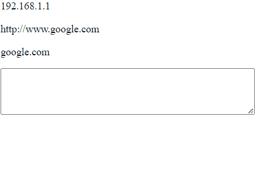

# DefangIt

 

**Simple chrome extension that defangs/refangs selected text on a web page**

**How to install?**

1) Open chrome
2) Type chrome://extensions/ in the browser
3) Enable developer mode
4) Click 'load unpacked' 
5) Select the DefangIt folder

Coming to the Chrome Store soon...

**How to use?**

Defang:

1) Select the text on the page
2) Cick the extension to open
3) Select Defang
4) The selected text will be replaced with the defanged version.

Refang:

1) Select the text on the page
2) Cick the extension to open
3) Select Refang
4) The selected text will be replaced with the refanged version.

